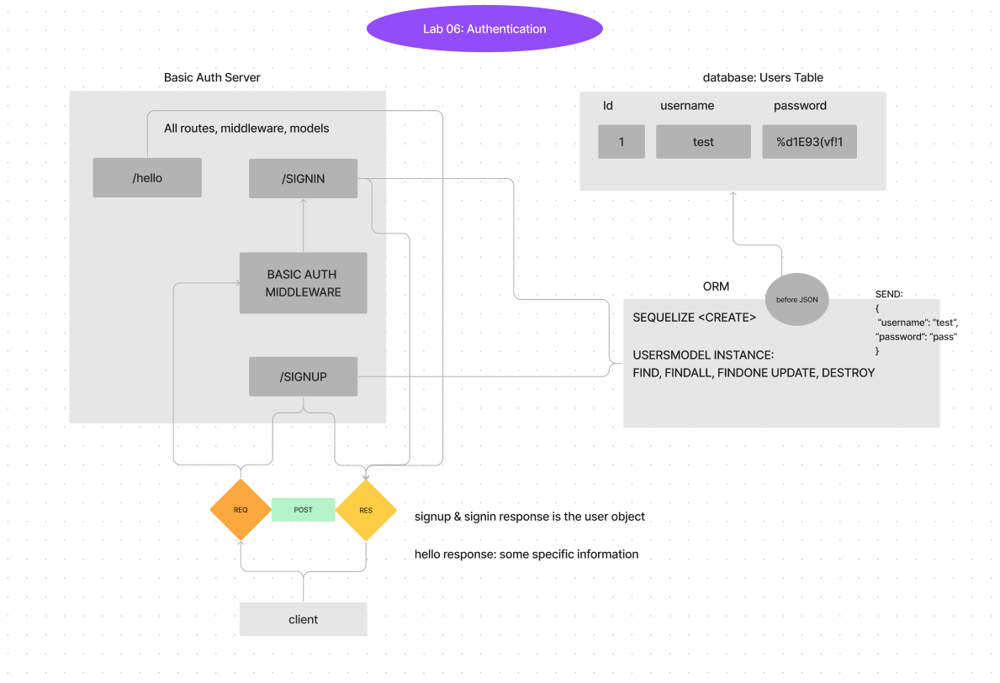

# LAB - 06 basic-auth

### Deployment Test

#### Author: Elaine Huynh

 #### Setup
    **.env** requirements
    - PORT - 3001
    - DATABASE_URL

    Running the app
    - npm start
    - Endpoint: /signup 
        - returns new user object
    - /signin
      - returns user object OR Not authorized error
    - /hello?name=<name>
      - return string

#### Tests
    - Unit Tests: npm run test
    - Lint Tests: npm run lint

#### UML

## Links
latest PR: https://github.com/nurselaine/basic-auth/pull/1